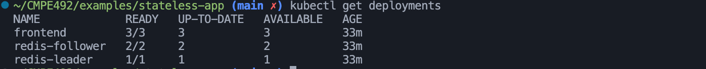
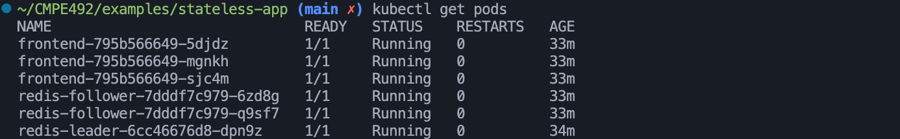
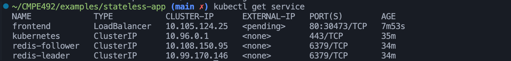
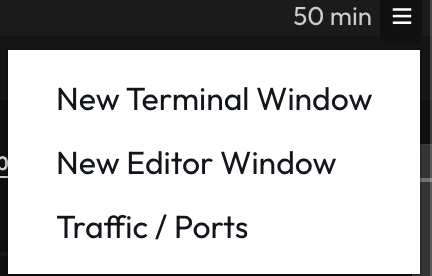
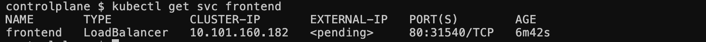
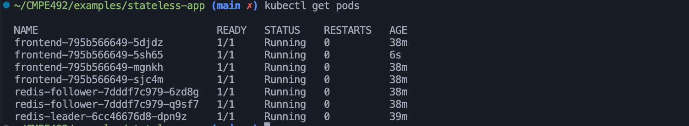
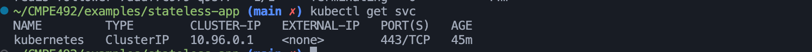
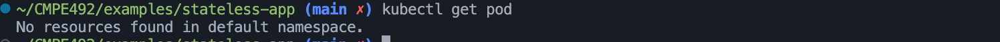
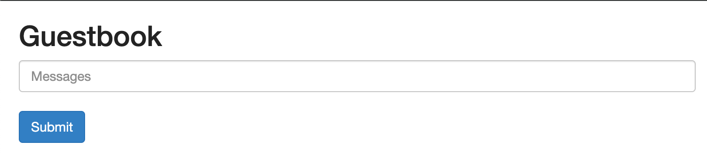

#DEPLOYMENT OF AN EXAMPLE STATELESS APPLICATION
Source: https://kubernetes.io/docs/tutorials/stateless-application/guestbook/ <br/>
Note: A kubernetes cluster is required.
##Steps:
* Run ```kubectl apply -f redis-leader-deployment.yaml```. This command creates a deployment object with 1 pod. The container in the pod uses a redis docker image.
* Run ```kubectl apply -f redis-leader-service.yaml```. This command creates a ```ClusterIP``` service to proxy the traffic to the Redis pod.
* Run ```kubectl apply -f redis-follower-deployment.yaml```. This command creates a deployment object with 2 pod. The containers in the pods uses a redis-follower image. These pods are used for increasing the availablity of redis.
* Run ```kubectl apply -f redis-follower-service.yaml```. This command creates a ```ClusterIP```service to proxy the traffic to the redis-follower pods.
* Run ```kubectl apply -f frontend-deployment.yaml```. This command creates a deployment object with 3 pods. The containers of these pods are the application containers.
* Run ```kubectl apply -f frontend-service.yaml```. This commands creates a ```LoadBalancer``` service. This service makes the application visible externally.
##Current State After the Steps
 <br/>
 <br/>
 <br/>
Note that the status of external ip for the frontend service is pending since a cloud provider which supports load balancers is not used.

##Accessing to the app
* If your cluster is in a cloud provider which supports load balancers, you can get the external ip address for the frontend service by running the following command. <br/>
```kubectl get service frontend```
* If you are using minikube, run ```minikube tunnel```. This command will create a tunnel for the application. After that, get the external ip address by running ```kubectl get service frontend```. You can access to the application with ```EXTERNAL-IP:80```.

* In killercoda, click on the menu and choose Traffic / Ports, then access to the application via NodePort of the service.


In my case the node port is 31540.
* In Play With Kubernetes, run ```kubectl port-forward svc/frontend 80:80```. Then the app is accessible via http://127.0.0.1:80.
##Scale the Web Frontend
* Run ```kubectl scale deployment frontend --replicas=4```. The number of pods of the deployment frontend will be increased to 4.

##Cleaning Up
* Run the following commands: 
```kubectl delete deployment -l app=redis```
```kubectl delete service -l app=redis```
```kubectl delete deployment frontend```
```kubectl delete service frontend```


##The Application

